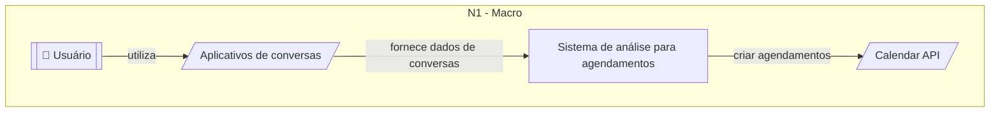
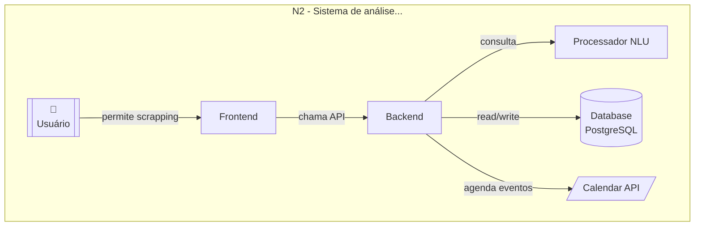
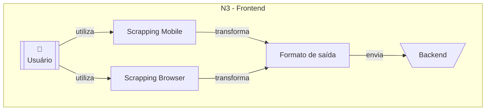
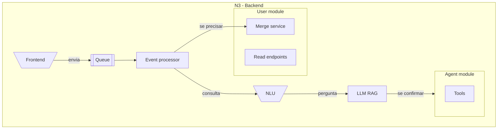

# arquitetura

```mermaid
flowchart TD
    subgraph n1["N1 - Macro"]
            n1-user[["👤 Usuário"]]
            n1-social[/"Aplicativos de conversas"/]
            n1-system["Sistema de análise para agendamentos"]
            n1-calendar[/"Calendar API"/]
    end

    n1-user -- utiliza --> n1-social
    n1-social -- fornece dados de conversas --> n1-system
    n1-system -- criar agendamentos --> n1-calendar
```

```mermaid
flowchart TD
    subgraph n2["N2 - Sistema de análise..."]
        n2-user[["👤 
            Usuário"]]
        n2-frontend["Frontend"]
        n2-backend["Backend"]
        n2-nlu["Processador NLU"]
        n2-database[("Database
            PostgreSQL")]
        n2-calendar[/"Calendar API"/]
    end

    n2-user -- permite scrapping --> n2-frontend
    n2-frontend -- chama API --> n2-backend
    n2-backend -- consulta --> n2-nlu
    n2-backend -- read/write --> n2-database
    n2-backend -- agenda eventos --> n2-calendar
```

```mermaid
flowchart TD
    subgraph n3-f["N3 - Frontend"]
            n3-f-user[["👤 
                Usuário"]]
            n3-mobile["Scrapping Mobile"]
            n3-browser["Scrapping Browser"]
            n3-format["Formato de saída"]
            n3-f-backend[\"Backend"/]
    end

    n3-f-user -- utiliza --> n3-mobile & n3-browser
    n3-mobile -- transforma --> n3-format
    n3-browser -- transforma --> n3-format
    n3-format -- envia --> n3-f-backend
```

```mermaid
flowchart TD
    subgraph n3-b["N3 - Backend"]
        n3-b-nlu[\"NLU"/]
        n3-b-frontend[\"Frontend"/]
        n3-ev-queue[["Queue"]]
        n3-ev-processor["Event processor"]
        n3-int-faketrue["LLM RAG"]
        n3-b-agent

        subgraph n3-b-user["User module"]
                n3-user-marge["Merge service"]
                n3-user-endpoint["Read endpoints"]
        end

        subgraph n3-b-agent["Agent module"]
                n3-b-agent-tools["Tools"]
        end
    end

    n3-b-frontend -- envia --> n3-ev-queue
    n3-ev-queue --> n3-ev-processor
    n3-ev-processor -- se precisar --> n3-user-marge
    n3-ev-processor -- consulta --> n3-b-nlu
    n3-b-nlu -- pergunta --> n3-int-faketrue
    n3-int-faketrue -- se confirmar --> n3-b-agent
```