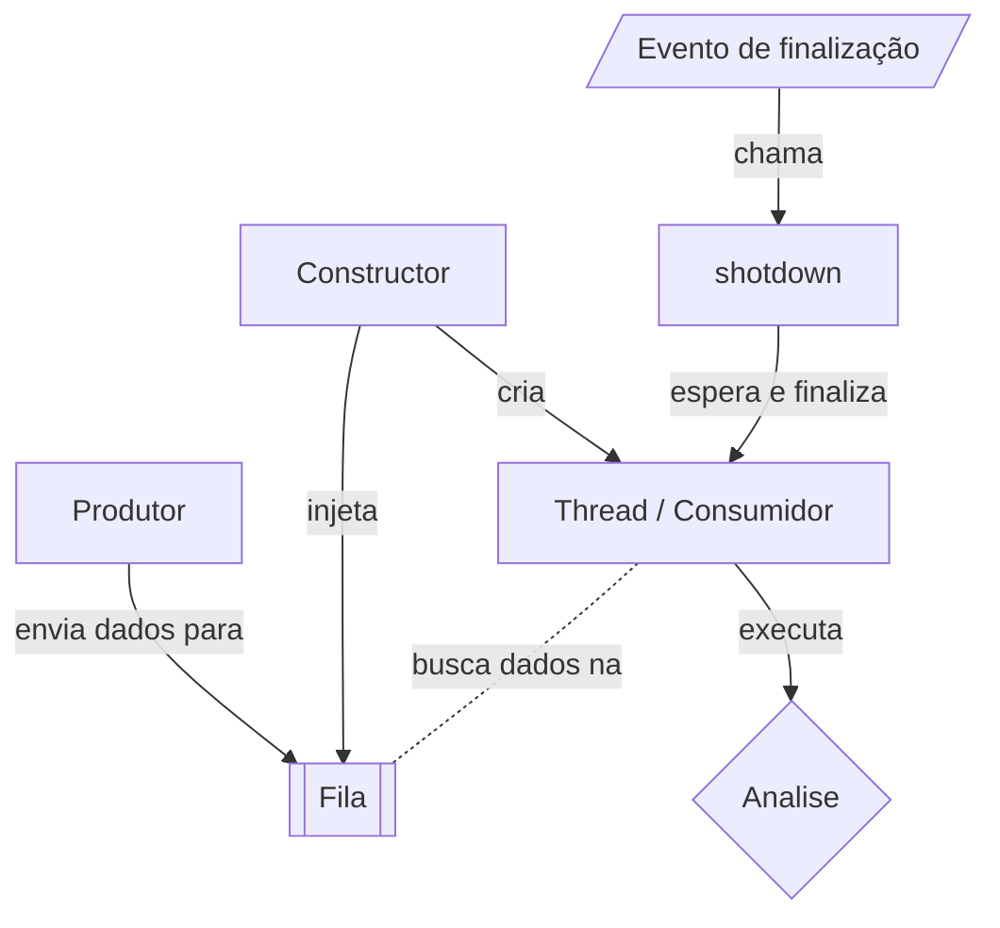

# Estratégia

## Formato de entrada

Decidi esse formato para as informações do tipo chat, guardo basicamente os o nome do app de chat, o contato e o chatID (nos casos que tenho acesso como telegram) em métadados, essa informação vai partir de uma classe genérica a todos os tipos de chat, mas o content vai poder variar entre os chats. (nota 24/07: como por enquanto estou vigiando apenas o whatsapp, então não me preocupei de fazer a separação, mas já foi feito de forma a ser fácil de separar.)

```typescript
// User representa o usuário enviando para análise, contato a pessoa com que ele está conversando.
type DataRole = 'user' | 'contact'

interface ITextRowData {
    id: string,
    role: DataRole,
    text: string
}

// Representa uma lista de componentes que o app de chat tem, por exemplo, além do "text row", o whatsapp tem "image preview", "audio preview", "link preview"...
type ChatDataContent = ITextRowData;

interface IChatDataMetadata {
    chatId: string | null
    contactName: string
    packageName: string
}

interface IChatDataDTO {
    metadata: IChatDataMetadata,
    content: ChatDataContent[]
}
```

## Fila

Inicialmente eu não preciso de um Redis, Rabbit ou Kafka, como em teoria só vai ter um usuário até a segunda ordem, uma fila em memória é mais que o suficiente, mas para não ficar a margem deus e horas de sono para mudar depois se necessário, vou criar um serviço interno de fila e abstrair com uma classe porque depois basta menter o mesmo formato.

Eu tenho um fluxo multi-thread, apesar de ter poucos usuários, ele vai receber um fluxo muito grande de eventos e vai rodar em uma VPS simples, talvez até em um raspberry então quero extrair o maior desempenho possível, provavelmente ele vai sofrer.

No planejamento eu tenho um orquestrador para a fila que vai cuidar da criação das threads, finalização e recebimento.

[ChatAnalizeQueue]



(nota 24/07: Adicionei um sleep para evitar custo de processamento e bussy wait, mas não sei exatamente qual vai ser o tempo de reatividade necessário do while true, validar isso mais tarde.)

## Logica

1. Informação chega na API *
2. Ela vai para uma fila. 
3. Vai ser direcionada para o NLU e salva em um banco de dados.
4. Caso o retorno do NLU seja uma intensão usada então vai para o RAG.
5. O RAG vai buscar as ultimas mensagens dessa conversa e identificar se não é um alarme falso como um planejamento por exemplo.
6. O Agente vai pegar essa informação olhar a conversa pela API do whatsapp e criar um evento no google calendar.