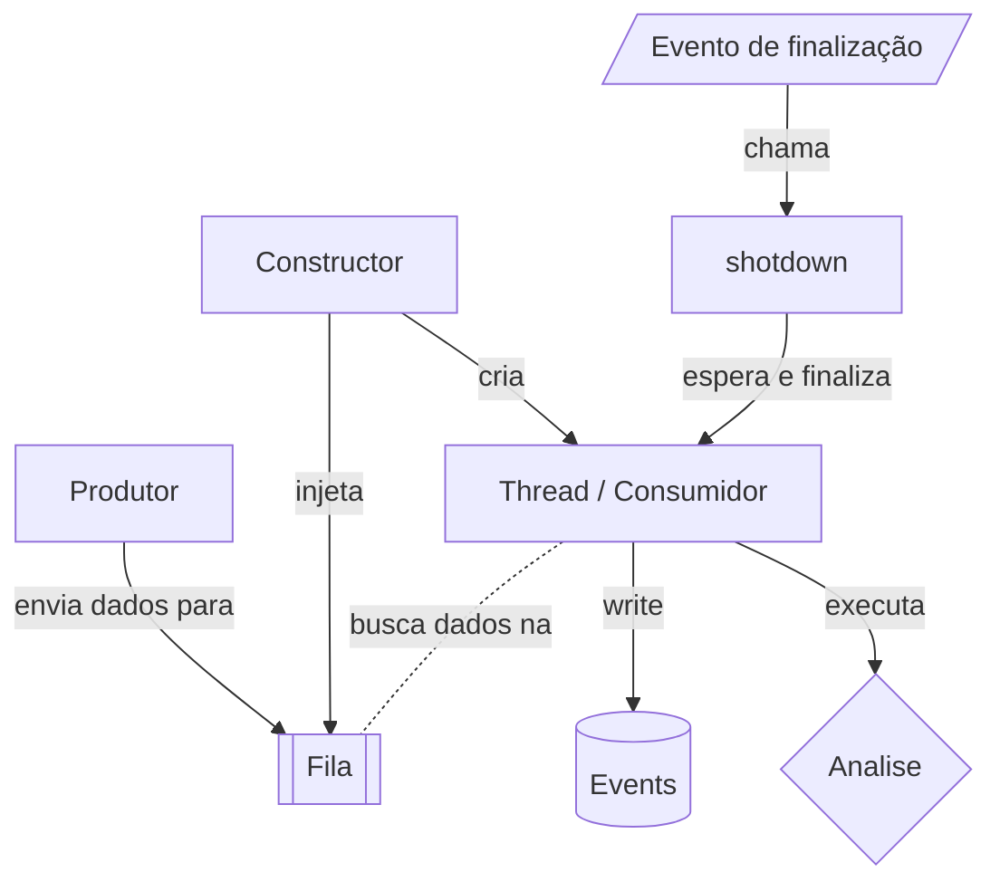
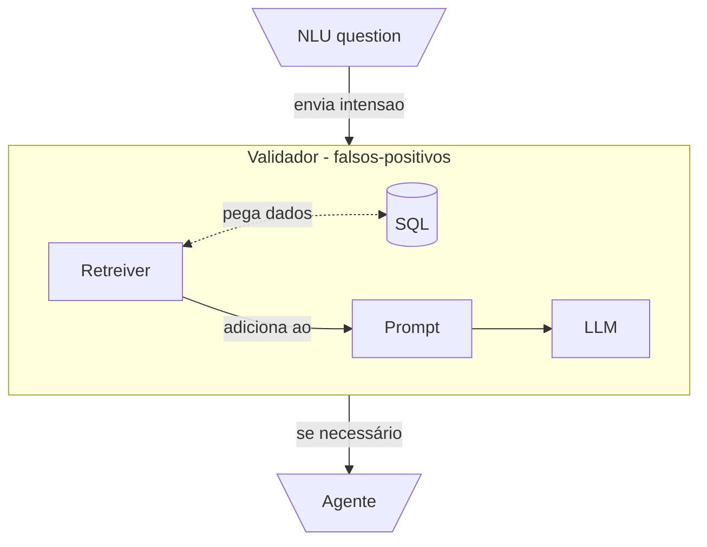

# Estratégia

## Formato de entrada

Decidi esse formato para as informações do tipo chat, guardo basicamente os o nome do app de chat, o contato e o chatID (nos casos que tenho acesso como telegram) em métadados, essa informação vai partir de uma classe genérica a todos os tipos de chat, mas o content vai poder variar entre os chats. (nota 24/07: como por enquanto estou vigiando apenas o whatsapp, então não me preocupei de fazer a separação, mas já foi feito de forma a ser fácil de separar.)

```typescript
// User representa o usuário enviando para análise, contato a pessoa com que ele está conversando.
type DataRole = 'user' | 'contact'

interface ITextRowData {
    id: string,
    role: DataRole,
    text: string
}

// Representa uma lista de componentes que o app de chat tem, por exemplo, além do "text row", o whatsapp tem "image preview", "audio preview", "link preview"...
type ChatDataContent = ITextRowData;

interface IChatDataMetadata {
    chatId: string | null
    contactName: string
    packageName: string
}

interface IChatDataDTO {
    metadata: IChatDataMetadata,
    content: ChatDataContent[]
}
```

## Fila

Inicialmente eu não preciso de um Redis, Rabbit ou Kafka, como em teoria só vai ter um usuário até a segunda ordem, uma fila em memória é mais que o suficiente, mas para não ficar a margem deus e horas de sono para mudar depois se necessário, vou criar um serviço interno de fila e abstrair com uma classe porque depois basta menter o mesmo formato.

Eu tenho um fluxo multi-thread, apesar de ter poucos usuários, ele vai receber um fluxo muito grande de eventos e vai rodar em uma VPS simples, talvez até em um raspberry então quero extrair o maior desempenho possível, provavelmente ele vai sofrer.

No planejamento eu tenho um orquestrador para a fila que vai cuidar da criação das threads, finalização e recebimento.

[ChatAnalizeQueue]



(nota 24/07: Adicionei um sleep para evitar custo de processamento e bussy wait, mas não sei exatamente qual vai ser o tempo de reatividade necessário do while true, validar isso mais tarde.)

## NLU

Aqui não tem segredo, estou usando o Rasa, então é só instalar o servidor adicionar o treinamento manual, iniciar o servidor para rodar o conjunto e deixar ele brilhar, o único ponto adicional para comentar é que tenho uma API responsável por coletar o resultado do Rasa e salvar como JSON para facilitar o retreinamento dele mais tarde. (nota 24/07: posso adicionar um teste A/B para auto treinamento evitando o tempo de eu mesmo treinar a NLU)

## RAG - Fake True

Principalmente enquanto o treinamento da NLU ainda for ruim, ela vai dar muitos falsos positivos, porém eu não tenho nem recursos e nem paciência para fazer o uso da API sem funcionamento antes, só para coletar dados e utilizar no treinamento geral do NLU.

Então entramos em um dilema, porque existe uma NLU aqui se uma LLM consegue fazer todo o trabalho sem treinamento prévio no modo plug-in-play e a resposta é tokens, eu vou ter dezenas se não centenas de eventos por segundo mesmo com poucos usuários, se eu mandar uma LLM (que é algo extremamente pesado e caro) verificar absolutamente todos os meus eventos para identificar se eu tenho ali um agendamento de alguma coisa, amanhã eu estou precisando vender meus rins para pagar.

A abordagem que tomei então é um meio termo, o NLU só vai funcionar bem quando tiver treinamento o suficiente, mas mesmo com um treinamento ruim (vulgo 10min de conversa), ele é capaz de filtrar 90% das coisas, os outros 10% eu vou enviar para o LLM agora se ia enviar 50 prompts para verificar, só vou enviar 5 e ainda de brinde, eu mantenho o treinamento da NLU, até que ela precise verificar 4, 3, 2... Até que ela acerte quase 100% das vezes.

Apesar de ser um RAG pelo conceito do que é um RAG, ele não vai seguir uma arquitetura tradicional porque não faz muito sentido, para mim é mais importante a ordem que foi dito do que o que foi dito em sí, então vou usar um banco de dados SQL sem embedding e capturar pelo repositorio a partir da data ordenando pelos mais novos com o tipo chat e pegar os 5 primeiros, o restante do processo vai ser feito normal adicionar a resposta ao prompt e mandar ele responder com base no que está lá. (nota 24/07: "os 5 primeiros" é um número arbitrário, ele pode e provavelmente vai ser modificado ao longo do tempo.)



## Agent - MCP

O agente precisa receber um intent e a partir dela acessar a API do whatsapp, consumir a conversa com aquele usuário específico e verificar as informações necessárias para criar um agendamento no google calendar.

## Logica

1. Informação chega na API *
2. Ela vai para uma fila. *
3. Vai ser direcionada para o NLU e salva em um banco de dados.*
4. Caso o retorno do NLU seja uma intensão usada então vai para o RAG.*
5. O RAG vai buscar as ultimas mensagens dessa conversa e identificar se não é um alarme falso como um planejamento por exemplo.*
6. O Agente vai pegar essa informação olhar a conversa pela API do whatsapp e criar um evento no google calendar.