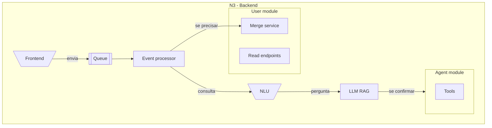

# Abordagem de execução

Fluxo diferente em relação ao primeiro, agora as coisas não vão mais necessáriamente rodar diretamente no mobile mesmo com a questão de segurança, pela facilidade de utilização, com a "Evolution API v2" disponível morre a necessidade de persistir o conteúdo do scrapping já que os principais programas de chat podem ser coletados normalmente de forma "oficial", salvo algumas excessões onde ainda vai ser usado a persistencia do scrapping porém em backend.

## Nova arquitetura

```mermaid
flowchart TD
    subgraph n1["N1 - Macro"]
            n1-user[["👤 Usuário"]]
            n1-social[/"Aplicativos de conversas"/]
            n1-system["Sistema de análise para agendamentos"]
            n1-calendar[/"Calendar API"/]
    end

    n1-user -- utiliza --> n1-social
    n1-social -- fornece dados de conversas --> n1-system
    n1-system -- criar agendamentos --> n1-calendar
```

```mermaid
flowchart TD
    subgraph n2["N2 - Sistema de análise..."]
        n2-user[["👤 
            Usuário"]]
        n2-frontend["Frontend"]
        n2-backend["Backend"]
        n2-nlu["Processador NLU"]
        n2-database[("Database
            PostgreSQL")]
        n2-calendar[/"Calendar API"/]
    end

    n2-user -- permite scrapping --> n2-frontend
    n2-frontend -- chama API --> n2-backend
    n2-backend -- consulta --> n2-nlu
    n2-backend -- read/write --> n2-database
    n2-backend -- agenda eventos --> n2-calendar
```

```mermaid
flowchart TD
    subgraph n3-f["N3 - Frontend"]
            n3-f-user[["👤 
                Usuário"]]
            n3-mobile["Scrapping Mobile"]
            n3-browser["Scrapping Browser"]
            n3-format["Formato de saída"]
            n3-f-backend[\"Backend"/]
    end

    n3-f-user -- utiliza --> n3-mobile & n3-browser
    n3-mobile -- transforma --> n3-format
    n3-browser -- transforma --> n3-format
    n3-format -- envia --> n3-f-backend
```

